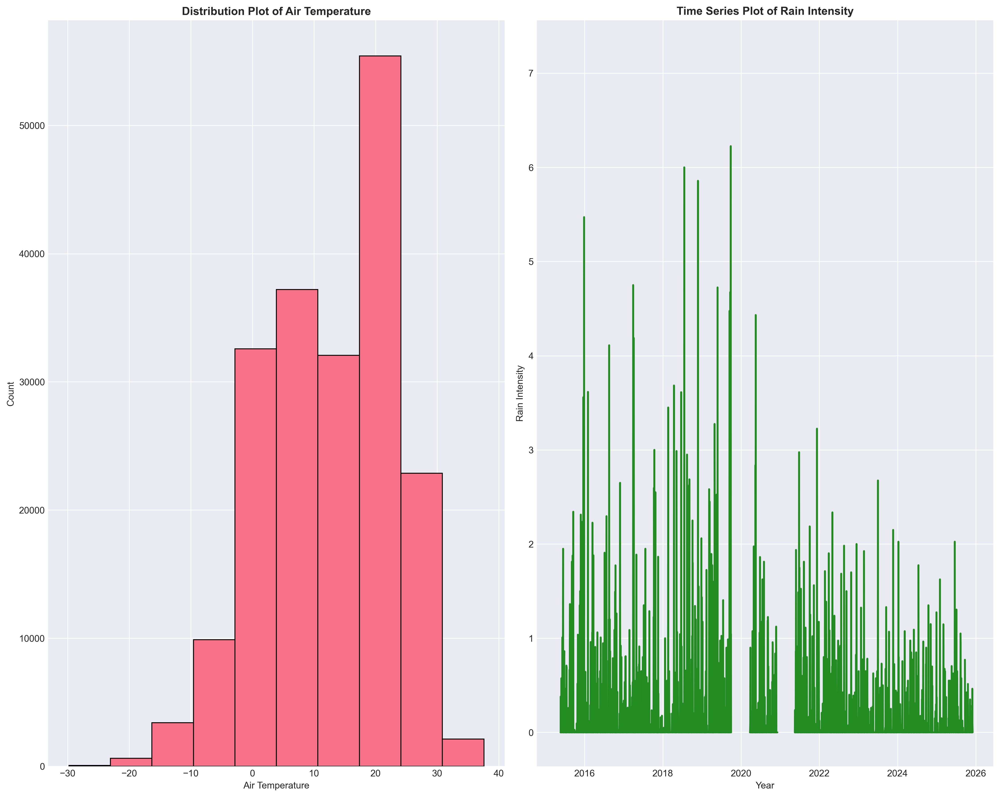
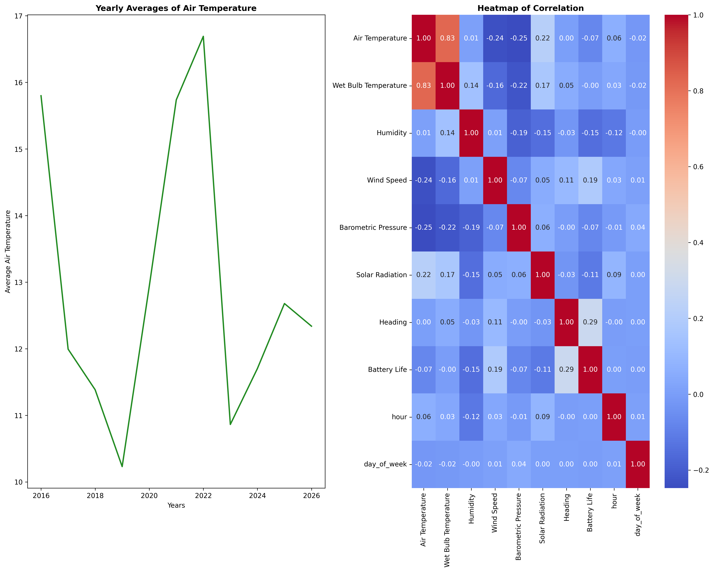
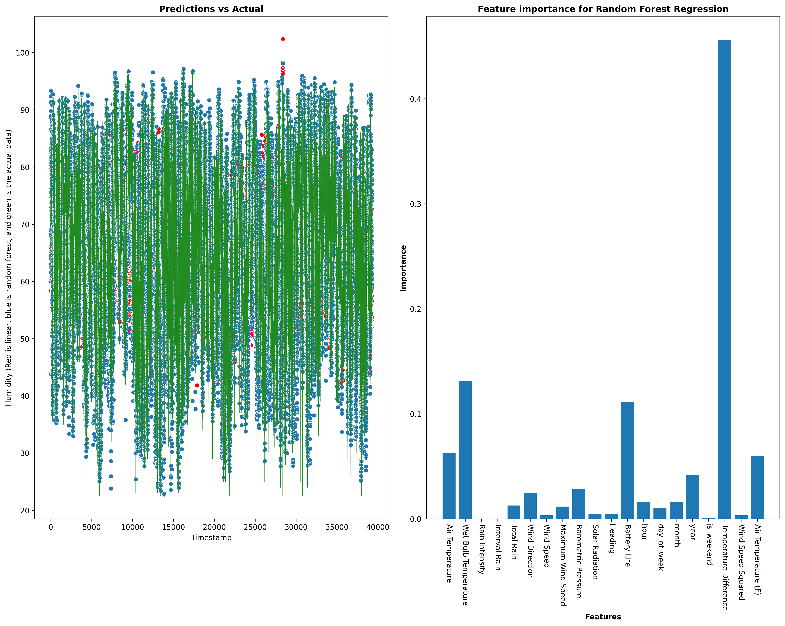

## Executive Summary

The dataset being analyzed in this project is Chicago's Beach Weather Sensors dataset. I wanted to know whether it is possible to predict the humidity rate based on the other factors measured in the dataset. I have found that the random forest regression model is pretty good at predicting the humidity rate, while the linear regression model isn't, largly due to the seasonal nature of the variables.

# Phase 1 and 2

There were missing values in the data. The columns Wet Bulb Temperature, Rain Intensity, Total Rain, Precipitation Type, and Heading all had 75935 missing values. Air Temperature had 75, and Barometric Pressure hd 146. The dates ranged from 01/01/2016 at 01:00:00 AM to 12/31/2024 at 12:00:00 PM. Preliminary analysis revealed some interesting information about air temperature and rain intensity. The most common value for air temperature seems to be 20 degrees celcius. 
As for rain intensity, the peak was during 2018 and 2019, followed by 2016. Post pandemic, the average rain intensity has gone down quite a bit. 

Figure 1: Bar chart of air temperature (how common each temperature was)
Figure 2: Time series plot of rain intensity over the years

# Phase 3

Missing values were imputed using forward fill. The IQR method was used to identify outliers, which were then capped. 
Columns and number of outliers before cleaning: 

| Columns | Amount of Outliers |
  |-------|----|
  | Air Temperature | 97 |
  | Wet Bulb Temperature | 269 | 
  | Humidity | 185 |
  | Rain Intensity | 6621 |
  | Interval Rain | 15850 |
  | Total Rain | 11621 | 
  | Precipitation Type | 12657 |
  | Wind Speed | 12221 |
  | Maximum Wind Speed | 4024 | 
  | Barometric Pressure | 4611 |
  | Solar Radiation | 29484 |
  | Heading | 27532 | 
  | Battery Life | 6 |

It is to be noted that Precipitation Type is a categorical variable, for at this portion of the pipeline it was considered to be numerical. 

# Phase 4

Further cleaning was done to account for the time readings of the censor data. This was done by converting the Measurement Timestamp column to datetime variable and indexing it, revealing the total duration of the study to be 3874 days and 13:00:00. Columns such as hour, week, day of week, etc. were added as well.

# Phase 5

Rolling window columns were added to the data. The feature list was also determined at this point in the pipeline to be: 

Temperature Difference
Wind Speed Squared
Air Temperature (F)
Comfort Index
Temp Ratio
Air Temperature Categories
Wind Speed Categories
air_temp_rolling_24h
wind_speed_rolling_7h

# Phase 6

Figure 3: Line plot of yearly average temperature
Figure 4: Heatmap of correlation matrix

Based on pattern analysis, 2016 and 2022 had the highest yearly average air temperature, with over 16 and a little under 16 degrees respectively. 2019 and 2023 had the lowest yearly average air temperature, with a little over 10 and a little under 11 degrees respectively. As for correlations, Air temperature and wet bulb temperature are highly correlated with an correlation value of 0.83. Heading and battery life are the second highest correlated variables with a value of 0.29. The highest negatively correlated variables are barometric pressure and air temperature with a value of -0.25.

# Phase 7

Modeling preparation was completed, using a temporal 80/20 train/test split method. The training set contained 157031 samples, ranging from 2015-04-25 at 09:00:00 to 2023-07-05 at 13:00:00. The test set contained 39258 samples, ranging from 2023-07-05 at 14:00:00 to 2025-12-02 at 22:00:00. A total of 22 features were selected (to be shown in phase 9 write up) to predict the target variable (Humidity). The Temp Ratio column had to be dropped from the train and test sets due to the NA values not being able to be imputed for some reason.  

# Phase 8

A linear regression model and random forest regression model were selected for the analysis. The follwing metrics were obtained:

| Metric | Linear Regression | Random Forest Regression |
  |-------|----|----|
  | Training r2 | 0.25188923154536325 | 0.99217391216381 |
  | Testing r2 | 0.18392712047217696 | 0.8178393391929699 | 
  | Training MAE | 11.017724304988171 | 0.6648414007425286 |
  | Testing MAE | 10.95633094586576 | 3.49109544551429 |
  | Training RMSE | 13.629523340306752 | 1.3940234312263486 | 
  | Testing RMSE | 13.418724059469113 | 6.339777936898852 |

Overall, the best performing model is the random forest regression model, as its r2 accuracy values for training and testing are both higher than the linear regression model, and its error metrics (mean absolute error and root mean squared error) are all lower as well. As for the features, Temperature Difference is the most important one, with a value of 0.46. Wet Bulb and Battery life are the 2nd and 3rd most important features. Year is the most important feature when looking at temporal features. One important thing to note is that the column Comfort Index had to be dropped at this time as it used Humidity in it's calculation, leading to data leakage.

# Phase 9

Figure 5: Actual values vs linear and random forest predicted values
Figure 6: Random forest regression model's feature importance

Overall, the random forest model fits the data better than the linear model, and because of that, it's predictions are closer to the actual values. The linear model seems to be unable to discern any trends as its looking for a linear relationship. In terms of features, it seems as though none of the features are really important to predict humidity, outside of Temperature Difference. There seems to be seasonal patterns when humidity is concerned, as it periodically goes up and down as the time passes, maybe due to seasons, day/night, etc. However, it seems to be fairly stable in its periodicity. 

For future directions, more models could be trained and tested, and more feautres (such as the amount of dew in the morning, sweat index, etc.) could be measured and selected to see if there could be a higher humidity predictive capability. These results could be validated by other data sets and other people's models. Eventually, more complicated models could be used to identify not just humidity values, but overall weather metrics. Things like storms and droughts could be predicted before they happen, allowing people to prepare for them. But overall, humity can be predicted with a fair amount of confidence for now.

